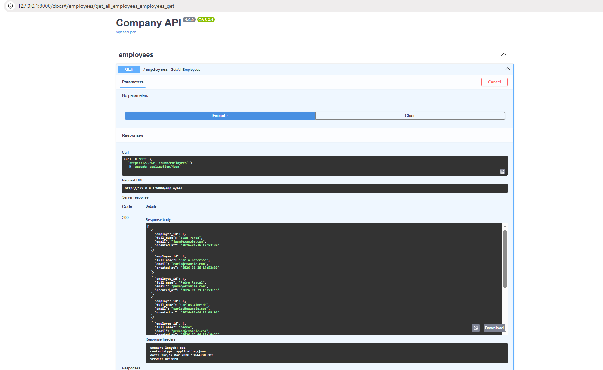

# Company API (V1) — Employees & Tasks

A small but production-style REST API built with **FastAPI + SQLite**, following a clean architecture (**routers / services / core**), typed contracts using **Pydantic**, and consistent logging.

This project is part of my backend portfolio and reflects my approach to building structured, maintainable backend systems.

## Overview

Production-style REST API built with FastAPI and SQLite.

This project demonstrates how to design and structure a backend service using clean architecture, data validation, and proper separation of concerns.

---

## Tech Stack

- FastAPI
- SQLite
- Pydantic
- Uvicorn

---

## Features

- **FastAPI** + interactive docs (Swagger/OpenAPI)
- **SQLite** database with constraints (e.g., unique email)
- **Pydantic models**
  - Request model: `EmployeeCreate`
  - Response models: `EmployeeOut`, `TaskOut`
- **Service layer** that converts SQLite `Row` → JSON-serializable `dict`
- **Logging**
  - Console logs
  - File logs (generated at runtime)
- **Input validation**
  - Email validation via `EmailStr`
  - Task status validation via Enum (`TaskStatus`)
- **Manual + automated testing (Swagger, curl, Postman, pytest)**

---

## Example Response

GET /employees → 200 OK



---

## API Documentation

Explore the API via Swagger after running locally:

http://127.0.0.1:8000/docs

---

## What this project demonstrates

- Designing REST APIs with FastAPI
- Structuring a backend using layered architecture (routers / services / core)
- Validating input and output using Pydantic
- Handling errors and returning consistent responses
- Working with SQLite and enforcing data constraints
- Converting database rows into API-friendly JSON responses
- Logging application behavior for debugging and traceability

---

## Project Structure

```text
company-api-v1/
├── README.md
├── requirements.txt
├── .gitignore
├── init_db.py
├── database/               # created/used at runtime (DB file is ignored by git)
└── source/
    ├── main.py             # DB functions (learning + utilities)
    ├── db_connection.py    # SQLite connection helper
    ├── schemas.py          # Pydantic schemas
    ├── api_legacy.py       # initial monolithic version (historical)
    ├── logs/               # log file generated at runtime (ignored by git)
    └── app/
        ├── api.py          # FastAPI app entrypoint
        ├── core/
        │   ├── db.py
        │   └── logging_config.py
        ├── routers/
        │   ├── employees_router.py
        │   └── tasks_router.py
        └── services/
            ├── employees_service.py
            └── tasks_service.py
```
> Note: `database/company.db` and `logs/app.log` are generated locally and ignored by git.


## Requirements

- Python **3.10+** (recommended: 3.11+)

---

## Setup (Run Locally)

1) Create and activate a virtual environment

**Windows (PowerShell):**

```powershell
python -m venv .venv
.\.venv\Scripts\Activate.ps1
```

**macOS / Linux:**

```bash
python3 -m venv .venv
source .venv/bin/activate
```

2) Install dependencies

```bash
pip install -r requirements.txt
```

3) Initialize the database (creates tables + inserts demo employee)

```bash
python init_db.py
```

4) Run the API

```bash
cd source
uvicorn app.api:app --reload
```

Open Swagger UI:

http://127.0.0.1:8000/docs


---

## Endpoints

### GET /employees

Returns the list of all employees.

**Response**
```json
[
  {
    "employee_id": 1,
    "full_name": "Pedro Ciruja",
    "email": "pedro@example.com",
    "created_at": "2026-02-03T18:42:11"
  }
]
```

### GET /employees/{employee_id}

Returns a single employee by ID.

**Response**
```json
{
  "employee_id": 1,
  "full_name": "Pedro Ciruja",
  "email": "pedro@example.com",
  "created_at": "2026-02-03T18:42:11"
}
```

### POST /employees

Creates a new employee.

**Request body**
```json
{
  "full_name": "Pedro Ciruja",
  "email": "pedro@example.com"
}
```

**Success response (201 Created)**
```json
{
  "message": "employee created"
}
```

### GET /tasks

Returns tasks for a specific employee, filtered by status.

**Query params**
- `employee_id` (int, required)
- `status` (enum, optional, default: `pending`)

> In V1, only `status="pending"` is supported.

**Response**
```json
[
  {
    "task_id": 1,
    "description": "Update emails",
    "status": "pending"
  }
]
```

---

## Status Codes

- `200 OK` — Successful request (GET endpoints)
- `201 Created` — Employee created successfully (POST /employees)
- `400 Bad Request` — Business rule violation (e.g., duplicate email)
- `404 Not Found` — Employee not found (GET /employees/{employee_id})
- `422 Unprocessable Entity` — Validation error (invalid request body or invalid query params, e.g. wrong email format)


## Logging

This API uses Python's built-in `logging` module to track requests and service-layer actions.

Logs are printed to the console and also written to:

- `logs/app.log`

**Typical log line**

```text
2026-02-04 12:23:59,031 | INFO | app.services.employees_service | employee_create called | email: pedro@example.com
```

## Notes

- SQLite is used as the database for V1.
- Timestamps are stored as text in SQLite (via `CURRENT_TIMESTAMP`), so `created_at` is returned as a string in V1.
- The architecture is intentionally simple but scalable (routers/services/core), and ready for a V2 refactor (PostgreSQL + Alembic + Docker + tests).

---

## How to test quickly

You can test this API using multiple approaches depending on your workflow.

### Swagger (UI)

Run the API and open:

http://127.0.0.1:8000/docs

Use Swagger to:
- Explore endpoints
- Send requests interactively
- Validate request/response structure
- Quickly test happy paths

---

### curl (Terminal)

Useful for testing raw HTTP behavior and debugging.

#### Create an employee

```bash
curl -X POST "http://127.0.0.1:8000/employees" \
-H "Content-Type: application/json" \
-d '{
  "full_name": "Pedro Ciruja",
  "email": "pedro@example.com"
}'

```

#### Get all employees

```bash
curl "http://127.0.0.1:8000/employees"
```

#### Get employee by ID

```bash
curl "http://127.0.0.1:8000/employees/1"
```

#### Get tasks by employee and status

```bash
curl "http://127.0.0.1:8000/tasks?employee_id=1&status=pending"
```

#### Expected behavior

Duplicate email → 400 Bad Request

Invalid email format → 422 Unprocessable Entity

Non-existing employee → 404 Not Found

No tasks found → 200 OK with empty list

---

## Testing

This API was thoroughly tested using a combination of manual and automated approaches to ensure correctness, stability, and contract consistency.

### Testing Strategies

#### 1. Swagger (Interactive Testing)

- Used for quick validation of endpoints
- Verified request/response flow
- Checked status codes and response structure

#### 2. curl (Terminal Testing)

- Verified raw HTTP behavior
- Inspected headers, status codes, and JSON responses
- Ensured consistency with Swagger results
- Tested edge cases (invalid input, duplicates, missing data)

#### 3. Postman

- Used for structured manual testing with saved collections
- Reproduced real request scenarios
- Validated:
  - Happy paths
  - Error handling (400, 404, 422)
  - Input validation and response consistency

#### Postman Collection

A ready-to-use Postman collection is included:

- `postman/company-api-v1.postman_collection.json`

Import it into Postman to reproduce the requests and test scenarios used during development.

#### 4. Pytest (Automated Testing)

- Implemented automated tests using FastAPI `TestClient`
- Covered:
  - Successful requests (200, 201)
  - Business rule validation (400)
  - Input validation (422)
  - Not found cases (404)
- Ensured endpoint contracts and behavior remain stable over time

### Coverage Highlights

- Contract validation (response_model enforcement)
- Input validation (Pydantic schemas)
- Error handling consistency
- Collection vs single resource behavior
- Empty dataset handling
- Repeated request stability
- Filtering logic (GET /tasks)

### Testing Documentation

Detailed testing scenarios, including expected vs observed behavior, are documented in:

- `testing.md`

This includes:
- Manual testing (Swagger, curl, Postman)
- Automated testing (pytest)
- Edge cases and validation scenarios

#### Run tests from project root:

```bash
python -m pytest -v
```

- Uses FastAPI `TestClient`
- Runs tests without needing the server running
- Ensures endpoint behavior and contracts remain stable

#### Expected Behavior
- Duplicate email → 400 Bad Request
- Invalid input → 422 Unprocessable Entity
- Non-existing resource → 404 Not Found
- Empty collections → 200 OK with []

These tests ensure the API behaves consistently across manual and automated validation layers.

---

## Future Improvements (V2)

This V1 version was intentionally built using a simple architecture and SQLite to focus on core backend principles, API design, data integrity, and service separation.

The next iteration (V2) will evolve this project into a more production-ready backend by introducing:

- Migration from SQLite → PostgreSQL  
- Database versioning using Alembic  
- Containerization with Docker  
- Automated testing with pytest  
- Environment configuration via `.env`  
- Improved error handling and validation patterns  
- Clear separation between development and production settings  
- Structured logging improvements  
- API documentation refinements  

The current structure (routers / services / core) was designed from the beginning to make this refactor natural and possible without rewriting the business logic.

V2 aims to transform this API from a learning project into a portfolio-grade backend service aligned with real-world backend practices.


## Pre-release Checklist

Before publishing or cloning the project:

1) `database/company.db` is NOT tracked  
2) `logs/app.log` is NOT tracked  
3) From project root: `python init_db.py` works  
4) `cd source` + `uvicorn app.api:app --reload` works  

You can use `git status` to verify which files are staged before committing.